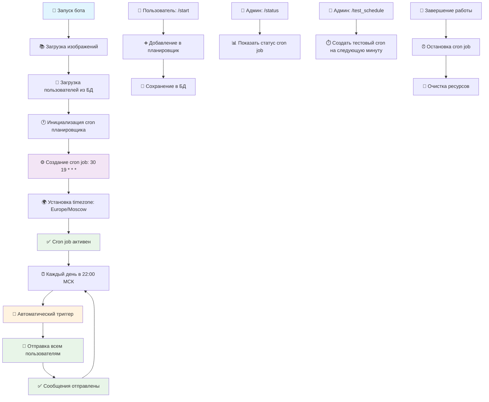

# PSY Froggy Bot 🐸 [](https://github.com/o-maan/psyfroggybot/actions/workflows/deploy.yml)

Бот-лягушка для психологической поддержки с интеграцией календаря и ежедневными сообщениями.

## Функции

- Ежедневные сообщения в 22:00
- Интеграция с Google Calendar
- Упрощённые сценарии для дней с перелётами
- Напоминания через 1.5 часа при отсутствии ответа
- База данных SQLite с миграциями

## Архитектура автоматического планировщика



## Технологии

- **Runtime**: Bun
- **Framework**: Telegraf (Telegram Bot API)
- **Database**: SQLite + Knex.js
- **AI**: Hugging Face Inference API
- **Calendar**: Google Calendar API
- **Web Server**: Caddy
- **Process Manager**: PM2
- **Notifications**: Telegram Bot API

## Деплой на Digital Ocean

### 1. Создание дроплета

Создайте Ubuntu 22.04 дроплет на Digital Ocean с минимум 1GB RAM.

### 2. Первоначальная настройка сервера

```bash
# Подключитесь к серверу по SSH
ssh root@your-server-ip

# Скачайте и запустите скрипт настройки
curl -O https://raw.githubusercontent.com/o-maan/psy_froggy_bot/main/setup-server.sh
chmod +x setup-server.sh
./setup-server.sh
```

### 3. Настройка переменных окружения

Отредактируйте файл `/var/www/psy_froggy_bot/.env`:

```bash
nano /var/www/psyfroggybot/.env
```

Добавьте:

```env
TELEGRAM_BOT_TOKEN=your_telegram_bot_token
HF_TOKEN=your_hugging_face_token
ADMIN_CHAT_ID=your_admin_chat_id
GOOGLE_CLIENT_ID=your_google_client_id
GOOGLE_CLIENT_SECRET=your_google_client_secret
NODE_ENV=production
```

### 4. Настройка GitHub Secrets

В настройках репозитория GitHub добавьте секреты:

- `DO_HOST`: IP адрес вашего сервера
- `DO_USERNAME`: имя пользователя (обычно `root`)
- `DO_SSH_KEY`: приватный SSH ключ
- `DO_PORT`: порт SSH (обычно `22`)
- `TELEGRAM_BOT_TOKEN`: токен Telegram бота для уведомлений

### 5. Настройка домена

Направьте DNS записи вашего домена на IP сервера:

```
A    psy_froggy_bot.invntrm.ru         -> your-server-ip
A    www.psy_froggy_bot.invntrm.ru     -> your-server-ip
```

### 6. Первый запуск

```bash
cd /var/www/psy_froggy_bot
pm2 restart psy_froggy_bot
pm2 logs psy_froggy_bot
```

## Автоматический деплой

При каждом мерже в `main` ветку:

1. 📲 Отправляется уведомление о начале деплоя в Telegram канал
2. Код автоматически обновляется на сервере
3. Запускаются миграции базы данных
4. Приложение перезапускается через PM2
5. Caddy перезагружается
6. 📲 Отправляется уведомление об успехе/ошибке в Telegram канал

## Локальная разработка

```bash
# Установка зависимостей
bun install

# Копирование переменных окружения
cp .env.example .env

# Запуск миграций
npx knex migrate:latest

# Запуск в режиме разработки
bun src/bot.ts
```

## Настройка

1. Создайте файл `.env` в корневой папке
2. Добавьте в него следующие переменные:

   ```env
   TELEGRAM_BOT_TOKEN=your_telegram_bot_token_here
   HF_TOKEN=your_huggingface_api_key_here
   ```

3. Создайте папку `images` и добавьте в неё картинки (jpg, png, jpeg)

## Запуск

```bash
# Мониторинг приложения
pm2 status
pm2 logs psy_froggy_bot
pm2 monit

# Перезапуск
pm2 restart psy_froggy_bot

# Проверка Caddy
sudo systemctl status caddy
sudo caddy validate --config /etc/caddy/Caddyfile

# Проверка логов
tail -f /var/log/pm2/psy_froggy_bot.log
tail -f /var/log/caddy/psy_froggy_bot.log
```

## Структура базы данных

- `users` - пользователи бота
- `messages` - история сообщений
- `user_tokens` - токены Google Calendar
- `user_image_indexes` - индексы картинок пользователей

## API Endpoints

- `GET /status` - проверка здоровья приложения
- `POST /oauth2callback` - callback для Google OAuth
- `POST /sendDailyMessage` - ручная отправка сообщений

## Команды бота

### Пользовательские команды

- `/start` - запуск бота и добавление в список рассылки
- `/fro` - отправить сообщение сейчас
- `/calendar` - настроить доступ к Google Calendar
- `/test` - отправить тестовое сообщение пользователю
- `/remind` - установить напоминание

### Административные команды (только для админа)

- `/status` - показать статус планировщика и количество пользователей
- `/test_schedule` - запланировать тестовое сообщение через 2 минуты
- `/next_image` - показать следующую картинку для пользователя
- `/minimalTestLLM` - тест работы с LLM

## Автоматическая работа

Бот автоматически:

1. **Отправляет сообщения в 22:00 МСК** каждый день с помощью cron job (`0 22 * * *`)
2. **Загружает пользователей** из базы данных при запуске
3. **Использует надежное планирование** с библиотекой node-cron
4. **Отправляет напоминания** через 1.5 часа при отсутствии ответа
5. **Генерирует контент** с помощью ИИ на основе календаря пользователя

### Преимущества cron над setTimeout

- ✅ **Надежность** - не зависит от перезапусков приложения
- ✅ **Точность** - срабатывает строго в заданное время
- ✅ **Часовые пояса** - поддержка московского времени
- ✅ **Простота** - стандартные cron выражения
